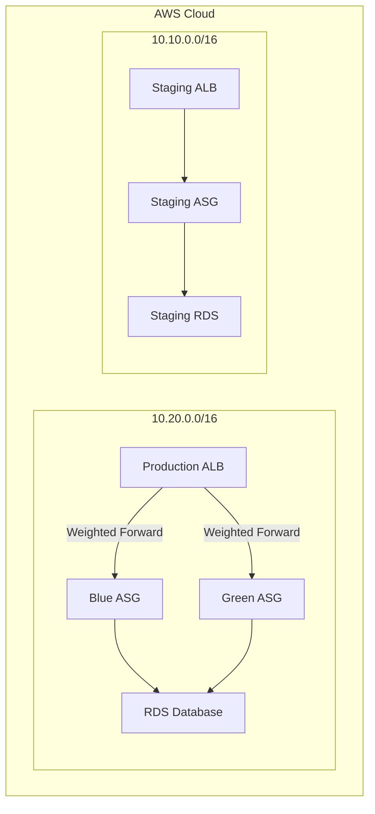

# Architecture Diagram

```mermaid
graph TD
    subgraph AWS Cloud
        subgraph Production VPC [10.20.0.0/16]
            ALB[Production ALB]
            ASG_B[Blue ASG]
            ASG_G[Green ASG]
            RDS[RDS Database]
            
            ALB -->|Weighted Forward| ASG_B
            ALB -->|Weighted Forward| ASG_G
            ASG_B --> RDS
            ASG_G --> RDS
        end
        
        subgraph Staging VPC [10.10.0.0/16]
            ALB_S[Staging ALB]
            ASG_S[Staging ASG]
            RDS_S[Staging RDS]
            
            ALB_S --> ASG_S
            ASG_S --> RDS_S
        end
    end
```
